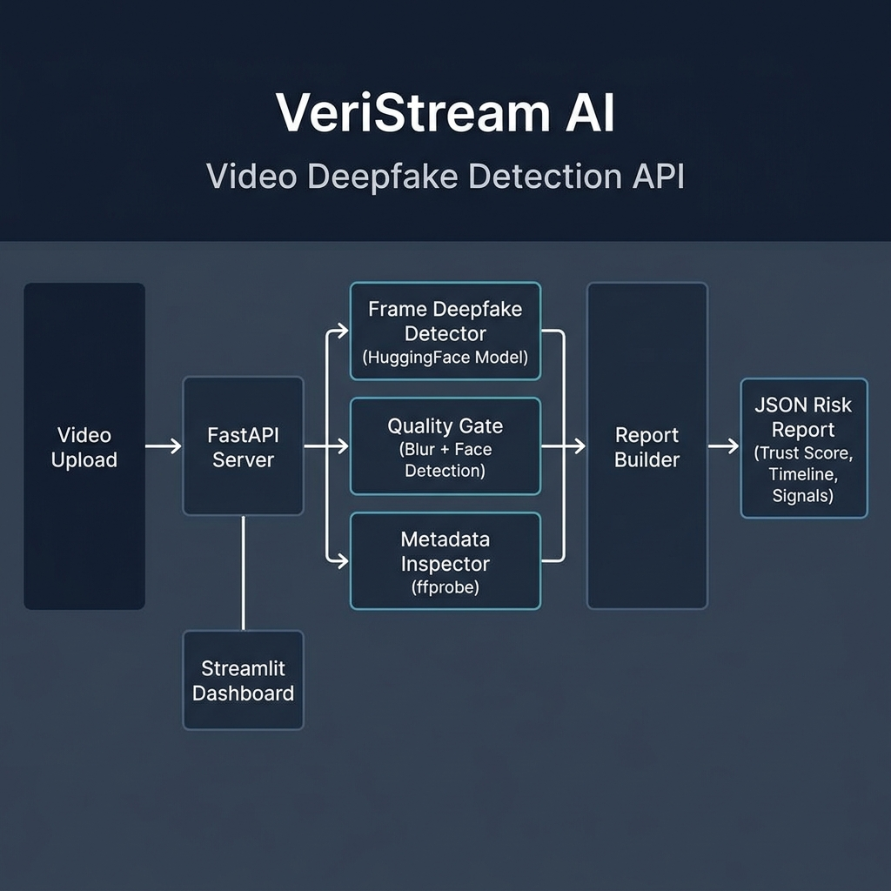

# VeriStream AI

A video verification API that detects deepfakes using frame-level analysis and pretrained deep learning models.

## Background

Deepfake videos are increasingly realistic and difficult to spot manually. VeriStream analyzes uploaded videos through multiple detection signals, then generates a structured report with trust scores, risk timelines, and editorial recommendations. The system combines a pretrained HuggingFace classifier with metadata inspection and quality gating to reduce false positives.

## How It Works

The platform runs three analysis stages on every uploaded video:

1. **Frame-level deepfake detection.** Extracts frames at regular intervals, runs each through the Deep-Fake-Detector-v2-Model (HuggingFace), and aggregates scores using a trimmed mean to reduce outlier noise.
2. **Quality gating.** Checks blur level (Laplacian variance) and face detection rate (Haar cascade) before analysis begins. Low-quality uploads are flagged before wasting compute.
3. **Metadata inspection.** Reads video container metadata via ffprobe, checking encoder software, device info, stream properties, and timestamp consistency.

Results are combined into a JSON report with a trust score (0-100), manipulation probability, frame-by-frame risk timeline, and plain-language editorial recommendations.

## Architecture



## Setup

```bash
# Clone and install
git clone https://github.com/atharvasathaye/Cozad.git
cd Cozad
python -m venv .venv
.venv/Scripts/activate    # Windows
pip install -r requirements.txt

# Start the API server
uvicorn app.main:app --reload --port 8000

# Start the Streamlit frontend (separate terminal)
streamlit run streamlit_app.py
```

Requires Python 3.10+ and ffprobe installed on PATH for metadata inspection.

## API Endpoints

| Endpoint | Method | Description |
|----------|--------|-------------|
| `/analyze/video` | POST | Upload a video file for analysis |
| `/report/{report_id}` | GET | Retrieve a completed analysis report |
| `/health` | GET | API health check |
| `/debug/frame-predict` | POST | Analyze a single image frame |

## Project Structure

```
app/
  main.py              FastAPI application and route handlers
  schemas.py           Pydantic models for requests and responses
  services/
    frame_deepfake_detector.py   HuggingFace model inference
    video_frames.py              OpenCV frame extraction
    quality_gate.py              Blur and face detection checks
    metadata_inspector.py        ffprobe metadata analysis
    report_builder.py            Report generation with risk timeline
    report_store.py              JSON file persistence
streamlit_app.py       Streamlit dashboard for uploading and reviewing results
```

## Tech Stack

Python 3.10, FastAPI, Streamlit, PyTorch, HuggingFace Transformers, OpenCV, ffprobe

## License

MIT